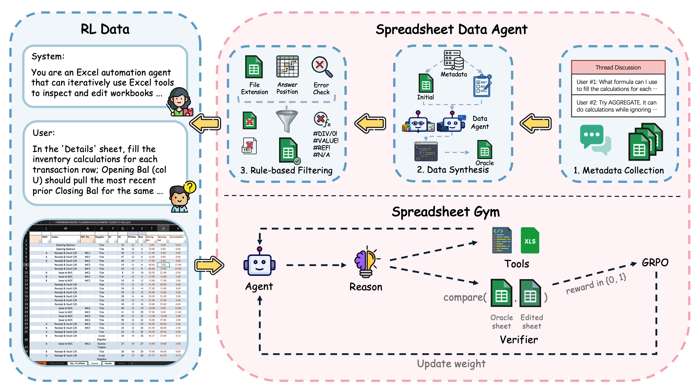

# Spreadsheet-RL

<p align="center">
  
</p>

<p>
<a href="https://arxiv.org/abs/2605.22642"></a>
<a href="https://spreadsheet-rl.github.io/"></a>
<a href="https://huggingface.co/datasets/Spreadsheet-RL/Spreadsheet-RL"></a>
<a href="https://huggingface.co/Spreadsheet-RL/Spreadsheet-RL-4B"></a>
<a href="LICENSE"></a>
</p>



Spreadsheet-RL is a reinforcement learning framework for training LLM agents on realistic spreadsheet tasks in a Microsoft Excel environment. It combines multi-turn spreadsheet interaction, spreadsheet-native tools, sandboxed code execution, and outcome-based rewards computed by recalculating and comparing final workbooks.

## News

- 📊 2026-06-30: Integrated [SpreadsheetBench-2](https://huggingface.co/datasets/KAKA22/SpreadsheetBench-v2) non-visual tasks into the Spreadsheet-RL dataset, adding 297 recalculated Debugging, Financial_Model, and Template tasks plus parquet splits.
- 🧰 2026-06-29: Improved spreadsheet-native tool scaffolding with sheet discovery, resilient cell search, and more accurate formula filling.
- 🧪 2026-06-09: Added [SpreadsheetBench-Verified](https://huggingface.co/datasets/KAKA22/SpreadsheetBench/blob/main/spreadsheetbench_verified_400.tar.gz) to the Spreadsheet-RL dataset, including verified spreadsheet artifacts and parser-specific parquet splits.
- 🔄 2026-06-03: Refreshed spreadsheet artifacts, removing samples with abnormal recalculation behavior, including excessive latency and memory usage; corresponding parquet splits are also updated.
- 🚀 2026-05-23: Released the Spreadsheet-RL-4B model checkpoint on Hugging Face at [Spreadsheet-RL/Spreadsheet-RL-4B](https://huggingface.co/Spreadsheet-RL/Spreadsheet-RL-4B), the RL-trained `Qwen/Qwen3-4B-Thinking-2507` spreadsheet agent used in the paper.
- 🌐 2026-05-22: The Spreadsheet-RL project page is now live at [https://spreadsheet-rl.github.io/](https://spreadsheet-rl.github.io/), with the paper overview, framework, results, resources, and citation.
- 📄 2026-05-21: The Spreadsheet-RL arXiv preprint is available at [arXiv:2605.22642](https://arxiv.org/abs/2605.22642), and the paper is featured on [Hugging Face Daily Papers](https://huggingface.co/papers/2605.22642).
- 📦 2026-05-17: Code and dataset release for Spreadsheet-RL. The code is available on GitHub at [Spreadsheet-RL/Spreadsheet-RL](https://github.com/Spreadsheet-RL/Spreadsheet-RL), with training configs, Slurm scripts, the Excel reward service, SandboxFusion setup, and the `verl` integration. The dataset is available on Hugging Face at [Spreadsheet-RL/Spreadsheet-RL](https://huggingface.co/datasets/Spreadsheet-RL/Spreadsheet-RL), with parquet splits and workbook files.

This code release contains the training and evaluation stack used by the Spreadsheet-RL paper:

- `configs/`: root-level training and tool configs.
- `scripts/`: Slurm launcher for multi-node FSDP training.
- `reward/`: async FastAPI reward service backed by Microsoft Excel recalculation.
- `sandbox/`: vendored SandboxFusion server plus the Apptainer definition used by rollouts.
- `verl/`: forked `verl` trainer code with Spreadsheet-RL tool and reward integration.

## Paper Highlights

Spreadsheet-RL combines three pieces:

- `Spreadsheet Data Agent`: an automated data-construction pipeline that turns public spreadsheet forum problems into paired initial and oracle final workbooks. The released training split contains 5,925 filtered ExcelForum tasks from raw public threads collected after January 1, 2024.
- `Spreadsheet Gym`: a multi-turn Microsoft Excel environment with per-rollout isolated workspaces, SandboxFusion-backed code execution, spreadsheet-native tools, and an async Excel reward service.
- `Spreadsheet-RL training`: GRPO post-training for spreadsheet agents using outcome rewards computed from final workbook correctness.

The paper reports the following main Pass@1 results for `Qwen/Qwen3-4B-Thinking-2507`:

| Evaluation | Base | + Native Harness | + Full Tools | + RL Training |
| --- | ---: | ---: | ---: | ---: |
| SpreadsheetBench | 12.0 | 15.6 | 19.3 | 23.4 |

On Domain-Spreadsheet, Spreadsheet-RL improves overall Pass@1 from 8.4 to 17.2 on 1,660 evaluation rollouts.

## Setup

### Training Environment

Install a `verl`-compatible Python environment on the training machine. The exact CUDA, PyTorch, vLLM, FlashAttention, and cluster module versions are environment-specific; follow the official `verl` installation guide for your hardware, then install this fork in that environment:

```bash
cd verl
pip install -e .
```

The Slurm launcher also requires `uvx` on each compute node because it uses `uvx hf download` to fetch the dataset, and optionally a model, from Hugging Face. If the training environment is not activated before launching Slurm, set `VENV_DIR` to the virtual environment path.

### SandboxFusion

Spreadsheet-RL uses SandboxFusion for the `code_interpreter` tool during rollouts. The provided Apptainer definition targets the aarch64 HPC environment used for this release:

```bash
cd sandbox
apptainer build --fakeroot ../sandboxfusion_workspace.sif SandboxFusion.aarch64.def
```

For local or non-Slurm runs, point the tool config at a running SandboxFusion service:

```bash
export SANDBOX_FUSION_URL="http://127.0.0.1:8080/run_code"
```

The Slurm launcher starts SandboxFusion on each allocated node when `SANDBOX_FUSION_SIF` points to the built image or when `sandboxfusion_workspace.sif` is found near the repo.

### Reward Service

Rewards are computed by uploading the agent-edited workbook to the async reward API, recalculating it in Excel, and comparing answer ranges against the oracle workbook. Run the service on a Windows machine with Excel installed:

```powershell
cd reward
uv sync
uv run async-reward-api --platform windows --host 127.0.0.1 --port 5000 --workers 2 --instance-per-worker 2
```

See [reward/README.md](reward/README.md) for deployment, concurrency, and diagnostics.

Set the training-side endpoints:

```bash
export SPREADSHEET_RL_REWARD_URL="http://<reward-host>:5000/reward/submit"
export SPREADSHEET_RL_RECALC_URL="http://<reward-host>:5000/recalculate"
```

### Dataset

The released dataset is hosted at [`Spreadsheet-RL/Spreadsheet-RL`](https://huggingface.co/datasets/Spreadsheet-RL/Spreadsheet-RL). It contains parser-specific parquet files plus a zipped workbook archive:

| File | Rows | Meaning |
| --- | ---: | --- |
| `train_hermes.parquet` | 5,925 | training split with Hermes tool-call formatting |
| `train_qwen3_coder.parquet` | 5,925 | training split with Qwen3-Coder tool-call formatting |
| `test_hermes.parquet` | 2,722 | SpreadsheetBench evaluation split with Hermes formatting |
| `test_qwen3_coder.parquet` | 2,722 | SpreadsheetBench evaluation split with Qwen3-Coder formatting |
| `test_2_hermes.parquet` | 297 | SpreadsheetBench-2 non-visual evaluation split with Hermes formatting |
| `test_2_qwen3_coder.parquet` | 297 | SpreadsheetBench-2 non-visual evaluation split with Qwen3-Coder formatting |
| `test_verified_hermes.parquet` | 400 | SpreadsheetBench-Verified evaluation split with Hermes formatting |
| `test_verified_qwen3_coder.parquet` | 400 | SpreadsheetBench-Verified evaluation split with Qwen3-Coder formatting |
| `test_domain_hermes.parquet` | 1,662 | Domain-Spreadsheet evaluation split with Hermes formatting |
| `test_domain_qwen3_coder.parquet` | 1,662 | Domain-Spreadsheet evaluation split with Qwen3-Coder formatting |
| `spreadsheets.zip` | 11,006 tasks | workbook files and task metadata |

Parquet filenames follow `train_<parser_type>.parquet`, `test_<parser_type>.parquet`, `test_2_<parser_type>.parquet`, `test_verified_<parser_type>.parquet`, and `test_domain_<parser_type>.parquet`. In the paper, `train` is the training split, `test` is SpreadsheetBench, `test_2` is the non-visual subset of SpreadsheetBench-2, `test_verified` is SpreadsheetBench-Verified, and `test_domain` is Domain-Spreadsheet. The parquet schema is `data_source`, `agent_name`, `prompt`, `ability`, `reward_model`, and `extra_info`.

`spreadsheets.zip` expands to `excelforum/`, `spreadsheetbench/`, `spreadsheetbench_2/`, `spreadsheetbench_verified/`, and `domain/`. Each task directory contains `instruction.json`, `input.xlsx`, `output.xlsx`, and `target.xlsx`. The archive contains 5,925 ExcelForum training tasks, 2,722 SpreadsheetBench tasks, 297 SpreadsheetBench-2 non-visual tasks, 400 SpreadsheetBench-Verified tasks, and 1,662 Domain-Spreadsheet tasks. The SpreadsheetBench-2 subset contains 100 Debugging, 100 Financial_Model, and 97 Template tasks; Visualization tasks are excluded because they require VLM evaluation.

The default Qwen3 4B launcher trains on `train_hermes.parquet` and validates on `test_hermes.parquet` from `SPREADSHEET_RL_DATA_ROOT`. For SpreadsheetBench-2 validation, set `TEST_FILE=test_2_hermes.parquet`; for SpreadsheetBench-Verified validation, set `TEST_FILE=test_verified_hermes.parquet`; for Domain-Spreadsheet validation, set `TEST_FILE=test_domain_hermes.parquet`. For Qwen3-Coder parser data, use the corresponding `*_qwen3_coder.parquet` files and set `actor_rollout_ref.rollout.multi_turn.format=qwen3_coder`.

For Slurm, the launcher downloads and wires the released Hugging Face dataset on every node. Override the repo id only if you have mirrored the dataset:

```bash
export SPREADSHEET_RL_HF_REPO_ID="Spreadsheet-RL/Spreadsheet-RL"
```

For manual runs, download the dataset under `data/`, unzip the workbook archive, and set `SPREADSHEET_RL_DATA_ROOT` if needed:

```bash
hf download Spreadsheet-RL/Spreadsheet-RL --repo-type dataset --local-dir data
unzip data/spreadsheets.zip -d data
export SPREADSHEET_RL_DATA_ROOT="$PWD/data"
```

## Training

Before submitting the Slurm job, edit [scripts/multinode_train_fsdp.slurm](scripts/multinode_train_fsdp.slurm) for your cluster:

- Replace Slurm placeholders such as `--account` and `--partition`.
- Set module names and system library paths if your cluster differs.
- Set `SANDBOX_FUSION_SIF` if the image is not in the default search path.
- Export `SPREADSHEET_RL_REWARD_URL` and `SPREADSHEET_RL_RECALC_URL`.
- Optionally override `SPREADSHEET_RL_HF_REPO_ID` if you use a dataset mirror instead of `Spreadsheet-RL/Spreadsheet-RL`.

Run the default Qwen3 4B config:

```bash
sbatch scripts/multinode_train_fsdp.slurm configs/qwen3-4b.sh
```

The launcher creates a per-job run directory, downloads the dataset, starts Ray and SandboxFusion on all nodes, sets `SPREADSHEET_RL_DATA_ROOT`, and launches training on the head node. By default the Qwen3 4B config uses `MODEL_REPO_ID` or `Qwen/Qwen3-4B-Thinking-2507` as the model path; set `MODEL_PATH` to a shared local model directory when running on clusters without model-download access from every node.

Useful overrides:

```bash
export MODEL_PATH="/path/to/local/model"
export SPREADSHEET_RL_MODEL_REPO_ID="Qwen/Qwen3-4B-Thinking-2507"
export SPREADSHEET_RL_WORKSPACES_DIR='/shared/spreadsheet_rl_workspaces/${SLURM_JOB_ID}'
```

`SPREADSHEET_RL_PREFETCH_MODEL=1` with `SPREADSHEET_RL_USE_PREFETCHED_MODEL=1` is intended for single-node jobs using a node-local model download. For multi-node jobs, use a shared `MODEL_PATH` or an HF model id that all nodes can access.

## Environment Variables

- `SANDBOX_FUSION_URL`: SandboxFusion `/run_code` endpoint.
- `SPREADSHEET_RL_DATA_ROOT`: dataset root used by tools and rewards.
- `SPREADSHEET_RL_REWARD_URL`: reward submit endpoint.
- `SPREADSHEET_RL_REWARD_TIMEOUT_S`: total reward request timeout.
- `SPREADSHEET_RL_REWARD_MAX_CONCURRENT`: cap on concurrent reward requests.
- `SPREADSHEET_RL_RECALC_URL`: recalculation endpoint used by spreadsheet tools.
- `SPREADSHEET_RL_HF_REPO_ID`: Hugging Face dataset repo id for the Slurm launcher; defaults to `Spreadsheet-RL/Spreadsheet-RL`.
- `SPREADSHEET_RL_CONFIG`: default config script used by the Slurm launcher when no positional config is passed.
- `SPREADSHEET_RL_PREFETCH_MODEL`, `SPREADSHEET_RL_MODEL_REPO_ID`, `SPREADSHEET_RL_USE_PREFETCHED_MODEL`: optional model prefetch controls for the Slurm launcher.
- `SPREADSHEET_RL_WORKSPACES_DIR`, `SPREADSHEET_RL_RUN_DIR`, `SPREADSHEET_RL_HF_LOCAL_DIR_BASE`, `SPREADSHEET_RL_MODEL_LOCAL_DIR_BASE`: optional Slurm runtime path overrides.

## Citation

If you use Spreadsheet-RL, including its data, environment, model, or training code, please consider citing our paper:

```bibtex
@misc{chi2026spreadsheetrl,
  title         = {Spreadsheet-RL: Advancing Large Language Model Agents on Realistic Spreadsheet Tasks via Reinforcement Learning},
  author        = {Banghao Chi and Yining Xie and Mingyuan Wu and Jingcheng Yang and Jize Jiang and Zhaoheng Li and Shengyi Qian and Minjia Zhang and Klara Nahrstedt and Rui Hou and Xiangjun Fan and Hanchao Yu},
  year          = {2026},
  eprint        = {2605.22642},
  archivePrefix = {arXiv},
  primaryClass  = {cs.AI},
  doi           = {10.48550/arXiv.2605.22642},
  url           = {https://arxiv.org/abs/2605.22642}
}
```

## Acknowledgements

Spreadsheet-RL builds on:

- [verl](https://github.com/verl-project/verl)
- [SandboxFusion](https://github.com/bytedance/SandboxFusion)

## License

Top-level Spreadsheet-RL release material is distributed under the [Creative Commons Attribution-ShareAlike 4.0 International License](LICENSE). Vendored components retain their upstream licenses; see [verl/LICENSE](verl/LICENSE) and [sandbox/LICENSE](sandbox/LICENSE).

---

<p>
<a href="https://arxiv.org/abs/2605.22642"></a>
<a href="https://spreadsheet-rl.github.io/"></a>
<a href="https://huggingface.co/datasets/Spreadsheet-RL/Spreadsheet-RL"></a>
<a href="https://huggingface.co/Spreadsheet-RL/Spreadsheet-RL-4B"></a>
<a href="LICENSE"></a>
</p>
